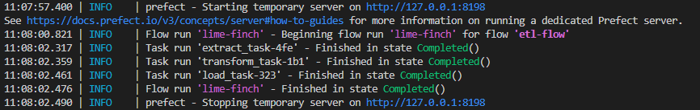
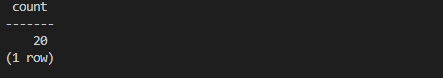
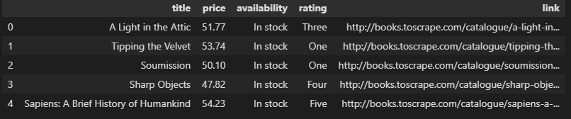
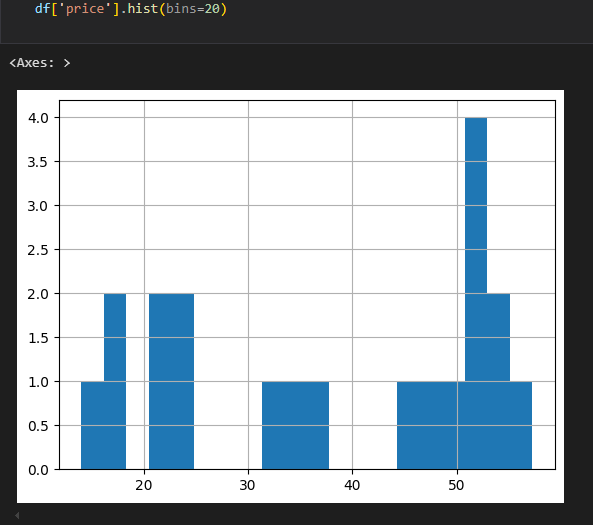
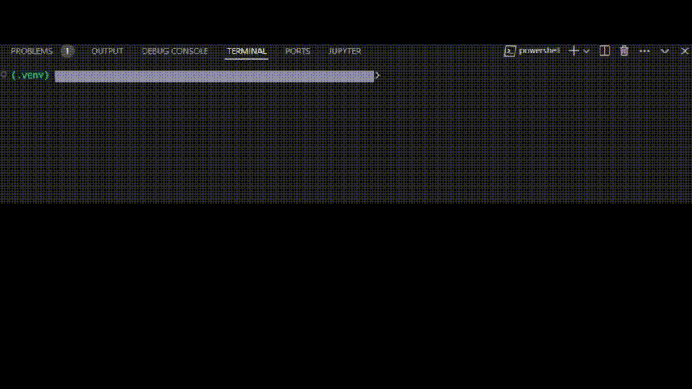

# ecommerce-ETL

[](https://github.com/EthoKikon/ecommerce-ETL/actions/workflows/ci.yml)

**End-to-end ETL demo**: scrape product metadata (books.toscrape.com), clean & validate data, save parquet snapshots and load into Postgres. Built with Python (pandas, pandera), Prefect orchestration, and Docker for local dev. This repo is a portfolio-ready example showing a full extraction → transform → load pipeline.

---

## Demo (screenshots)

### ETL flow run (Prefect)


_Caption:_ Prefect flow execution — extract → transform → load complete (shows task start/finish).

### CLI quick run


_Caption:_ Running `python -m src.cli --pages 1` to execute the pipeline end-to-end.

### DB verification (rows loaded)


_Caption:_ `SELECT COUNT(*) FROM books;` verifies number of rows loaded into Postgres.

### Sample cleaned data


_Caption:_ First 5 rows from `outputs/books_clean.parquet` / `books` table.

### Quick visualization


_Caption:_ Example visualization produced in `notebooks/dev_playground.ipynb`.

### Perfect flow Demonstration


_Caption:_ Prefect flow demonstration — extract → transform → load complete.

---

## Quick overview

- **Extractor:** `src/extract.py` (web scraping with `requests` + BeautifulSoup).
- **Transformer:** `src/transform.py` (pandas cleaning, robust price parsing, pandera validation).
- **Loader:** `src/load.py` (writes parquet & loads to Postgres via SQLAlchemy).
- **Orchestration:** `src/flow.py` (Prefect flow).
- **CLI:** `src/cli.py` — run the pipeline with `python -m src.cli --pages N`.
- **Tests & linting:** `pytest`, `pre-commit` (black, isort, flake8).
- **Dev infra:** `docker/` + `docker-compose.yml` for local Postgres.

---

## Quickstart (local, 5 minutes)

1. **Copy environment file**
   ```bash
   cp .env.example .env
   # Edit .env if you want to change DB creds or output dir
   ```
2. **Start Postgres**
   ```bash
   docker compose up -d db
   ```
3. **Create & activate Python venv, install deps**
   ```bash
   python -m venv .venv
    # PowerShell
    .\.venv\Scripts\Activate.ps1
    # then
    python -m pip install --upgrade pip
    python -m pip install -r requirements.txt
   ```
4. **Run the pipeline (srcape one page)**
   ```bash
    python -m src.cli --pages 1
   ```
5. **Or run the Perfect flow (same ETL)**
   ```bash
    python -m src.flow
   ```
6. **Copy environment file**
   ```bash
    docker compose exec db psql -U etl_user -d etl_demo -c "SELECT COUNT(*) FROM books;"
   ```

## Project Structure

```bash
ecommerce-etl/
├─ src/                 # ETL code: extract, transform, load, flow, cli
├─ notebooks/
├─ tests/               # unit tests (pytest)
├─ docker/              # Dockerfile
├─ docker-compose.yml
├─ pyproject.toml       # for linters/formatting
├─ docs/                # notebook exports, screenshots, executive summary
|  └─ images/           # flow_run.png, db_count.png, sample_rows.png, price_hist.png
└─ README.md

```

## Running tests & CI

- Locally:
  ```bash
  .\.venv\Scripts\Activate.ps1
  python -m pytest -q
  ```
